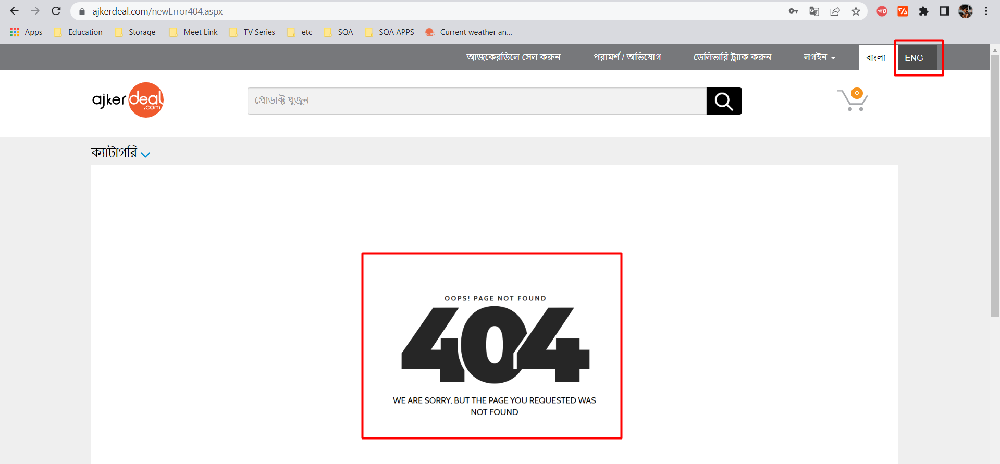

<H1 align="center">BUG tracking Using Jira</H1>

<H3 align="center">Ajkerdeal</H3>

Description:
1.	Go to URL = https://ajkerdeal.com/ 
2.	Change Language to English
3.	Go to another tab.
4.	The language is changed to Bangla automatically. And even changing to English An Error is showing.  
<b>Observation:</b> while changing from one tab to another tab in the menu bar the language is changed back to Bangla. If a person changes the language once he/she doesn’t need to do it twice to change the tabs.

Description: The work was assigned to Akash15-1714 for solving the issue.

Description: The developer is working and it was in progress is started.

Description: Developer completed the work and the issue is solved.
