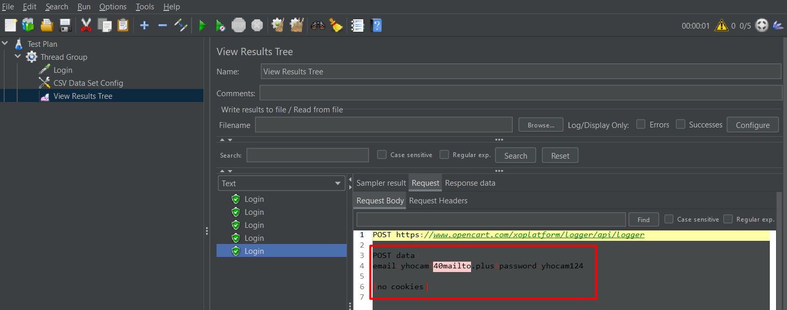

Dear Concerned, 

I’ve completed performance test on frequently used API for test App. 
Test executed for the below mentioned scenario in https://www.opencart.com

Here the test was done on login page. 
First registered the webpage with five temporary email. Then the test was done on the login page using a CSV file.
 

While executed 5 concurrent request, found  5 request got connection timeout and error rate is 0. 

Summary: Server can handle all the login concurrent 1 API call with almost zero (0) error rate.
Server can login all 5 users in the system without any error.

Please find the details report from the attachment and  let me know if you have any further queries. 

## Please find the detail screenshot 

